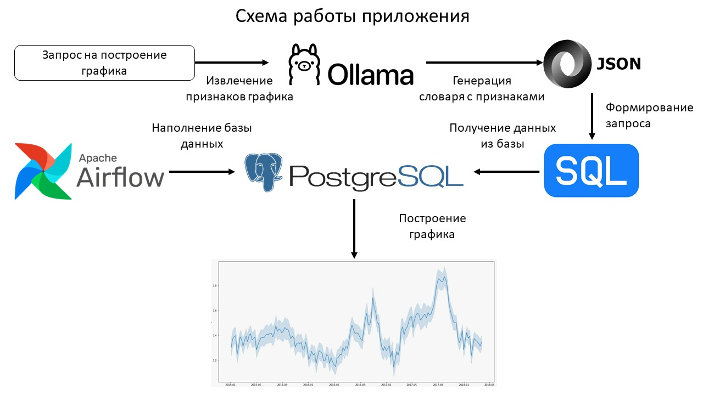
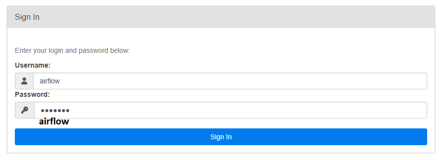
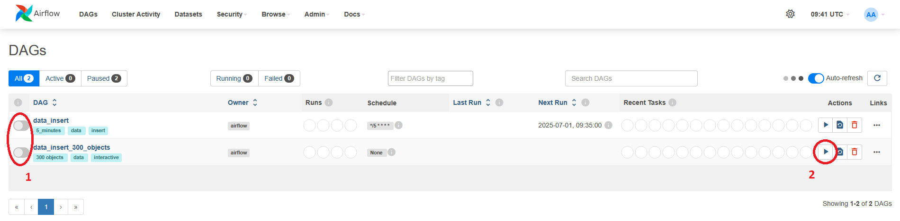
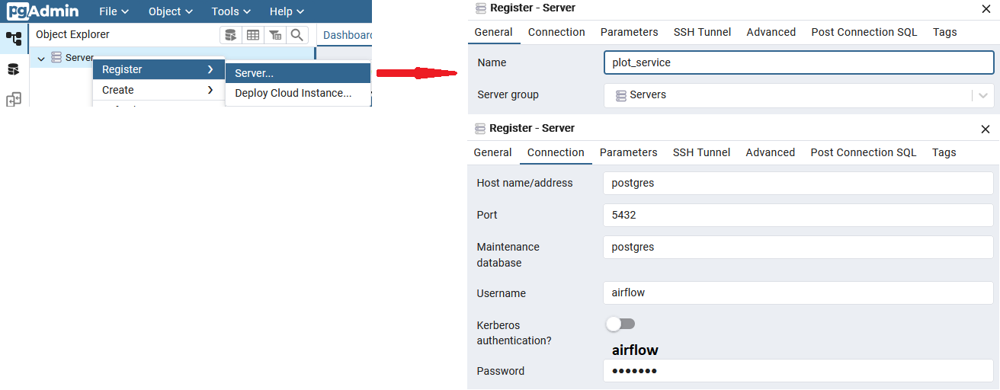
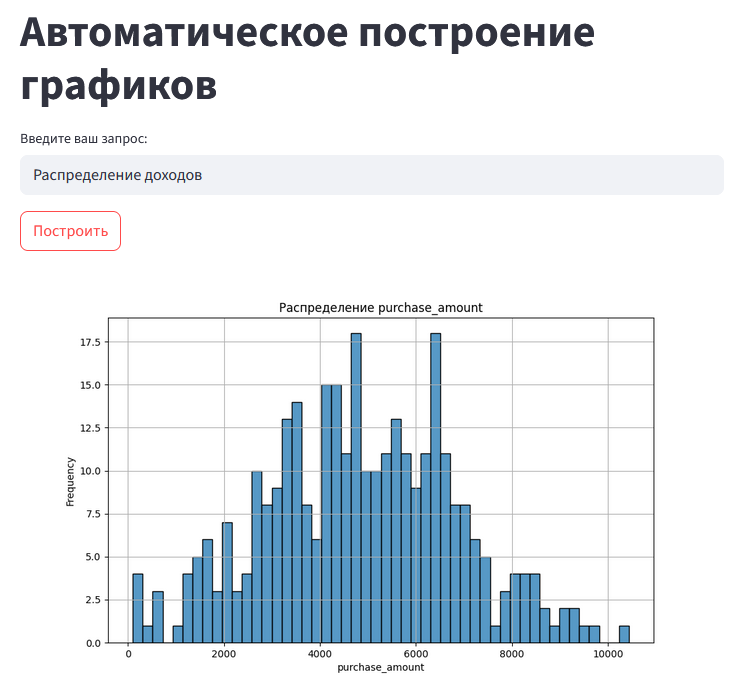

# Интерактивное приложение для анализа данных с использованием LLM, Airflow, FastAPI и Streamlit

## Описание

Это приложение позволяет пользователям анализировать данные с помощью естественного языка. Оно использует большую языковую модель (LLM) для обработки запросов пользователей, генерирует SQL-запросы, выполняет их в базе данных PostgreSQL. Результаты отображаются в виде графиков в Streamlit-приложении.



## Технологии
*   **Streamlit:** Фронтенд для интерактивного отображения данных и взаимодействия с пользователем.
*   **FastAPI:** Backend для обработки запросов, взаимодействия с LLM и Airflow.
*   **Ollama (mistral):** Генерация json с признаками для построения графиков на основе запросов пользователя на естественном языке.
*   **Apache Airflow:** Периодическое наполнение базы данных PostgreSQL.
*   **PostgreSQL:** База данных для хранения и обработки данных.

## Архитектура
1.  Пользователь вводит запрос на естественном языке в Streamlit-приложении.
2.  Streamlit отправляет запрос в FastAPI backend.
3.  FastAPI отправляет запрос в Ollama для генерации json-словаря с признаками графика (тип графика, ось X, ось Y, вид агрегации и фильтр по временному промежутку) на основе запроса пользователя.
4.  FastAPI формирует SQL-запрос на основе json из LLM.
5.  FastAPI выполняет SQL-запрос в базе данных PostgreSQL и формурует DataFrame.
6.  FastAPI выполняет построение графика, преобразует его в PNG и возвращает в Streamlit-приложение.
7.  Streamlit отображает данные в виде статичного графика.

## Установка
1.  **Клонируйте репозиторий:**
```bash
git clone <your_repository_url>
cd <your_repository_directory>
```

2.  **Установите Docker и Docker Compose:**
*   [Docker](https://docs.docker.com/get-docker/)
*   [Docker Compose](https://docs.docker.com/compose/install/)
3. **Развертывание приложения**
* Запустить makefile командой
```bash
make -f makefile first_start
```
Во время первого запуска автоматически выполняется:
1. копирование переменных из example.env; 
2. создание контейнера Docker-compose;
3. создание SQL-таблицы sales_data, с которой будет работать приложение;
4. скачивание указанной LLM (по умолчанию mistral);
5. настройка подключения Airflow к PostgreSQL;
6. На экран выводятся доступные порты для перехода в интерфейсы приложений.

## Работа с приложением

* Перейти в браузере по ссылке [Airflow](http://localhost:8080/). Необходимо авторизоваться в приложении. Логин и пароль определяюся значениями переменных: `_AIRFLOW_WWW_USER_USERNAME` и `_AIRFLOW_WWW_USER_PASSWORD` 



Откроется интейрфейс Airflow. Необходимо активировать DAG data_insert и data_insert_300_objects (пункт 1). При первом запуске рабочая таблица пуста, поэтому необходимо вручную запустить DAG data_insert_300_objects (пункт 2). После этого сгенерируется 300 объектов и одним запросом добавится в таблицу sales_data.



* Чтобы проверить состояние таблицы, необходимо перейти по ссылке [pgAdmin](http://localhost:8080/) - UI для работы с PostgreSQL. Логин и пароль определяюся значениями переменных: `PGADMIN_DEFAULT_EMAIL` и `PGADMIN_DEFAULT_PASSWORD` 


После этого необходимо подключить pgAdmin к PostgreSQL как на рисунке ниже:



А далее по дереву в левой части перейти в plot_service -> Databases -> airflow -> Tables -> sales_data и выбрать view data или query. Когда таблица создана и заполнена, можно перейти в Streamlit-приложение.

* Перейти в браузере по ссылке [Streamlit](http://localhost:8501/). Откроется интерфейс приложения:



В текстовое поле введите запрос на естественном языке, описывающий данные, которые вы хотите получить. Приложение отправит запрос в backend, сгенерирует SQL-запрос, выполнит его и отобразит результаты в виде графика.

## Дополнительные настройки

*   **Изменение языковой модели:** Вы можете изменить языковую модель (выбрать доступную из каталога Ollama), используемую для генерации SQL-запросов, изменив значение переменной `MODEL` в файле `.env`.